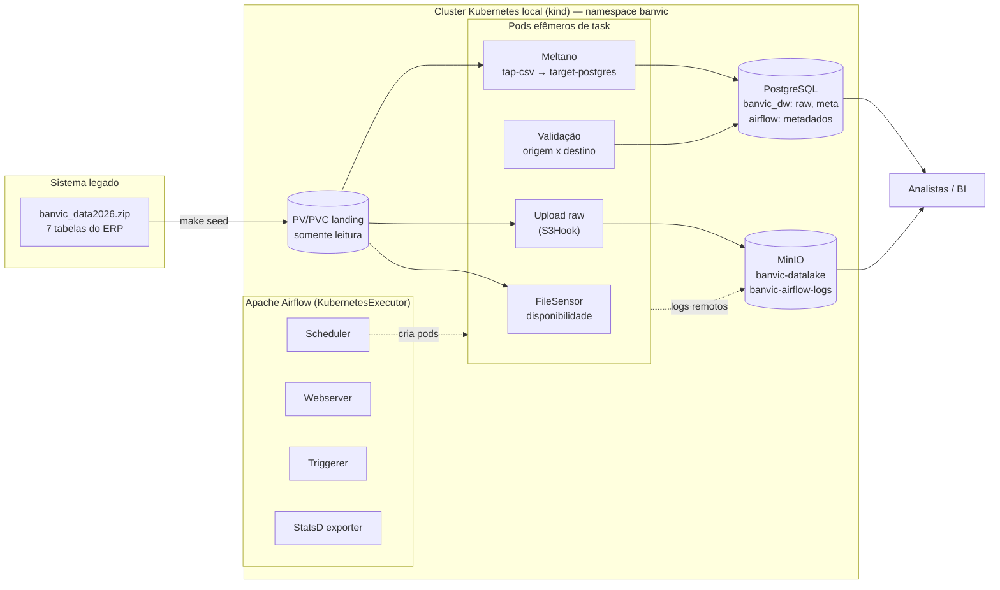

# BanVic — Plataforma de Ingestão de Dados

POC de infraestrutura e pipeline de ingestão para o Banco Vitória S.A. (BanVic), desenvolvida
como entrega da Certificação Data Engineer da Indicium.

O objetivo é tirar as análises das planilhas e colocar os dados do ERP em um ambiente
centralizado, versionado e reprodutível, onde os analistas (e o piloto de crédito do Lucas)
possam trabalhar sem depender de exportações manuais.

Tudo roda em um cluster Kubernetes local, provisionado por Terraform, com Airflow orquestrando
uma ingestão ELT feita em Meltano.

---

## Sumário

- [Arquitetura](#arquitetura)
- [Decisões técnicas](#decisões-técnicas)
- [Pré-requisitos](#pré-requisitos)
- [Subindo o ambiente](#subindo-o-ambiente)
- [Executando o pipeline](#executando-o-pipeline)
- [Estratégia de ingestão](#estratégia-de-ingestão)
- [A DAG](#a-dag)
- [Resiliência e monitoramento](#resiliência-e-monitoramento)
- [Gerenciamento de segredos](#gerenciamento-de-segredos)
- [Estrutura do repositório](#estrutura-do-repositório)
- [Testes](#testes)
- [Problemas comuns](#problemas-comuns)
- [Próximos passos](#próximos-passos)

---

## Arquitetura



Fluxo em uma frase: os arquivos do ERP chegam em uma landing zone montada como volume
somente leitura, o Airflow confere a disponibilidade, grava uma cópia bruta particionada no
Data Lake e, em paralelo, dispara o Meltano em um pod dedicado para carregar o schema `raw`
do Data Warehouse, terminando com validação e registro de auditoria.

### Componentes

| Camada | Ferramenta | Papel |
|---|---|---|
| Cluster | kind (Kubernetes 1.31) | Ambiente isolado e descartável, igual em qualquer máquina |
| IaC | Terraform (providers `kubernetes` e `helm`) | Namespace, Secrets, PV/PVC, PostgreSQL, MinIO e release do Airflow |
| Orquestração | Apache Airflow 2.10.5 (chart oficial 1.16.0) | DAG, sensores, dependências, retries, agendamento |
| Ingestão | Meltano 3.7 (`tap-csv` → `target-postgres`) | Extract + Load com MERGE por chave primária |
| Data Lake | MinIO (API S3) | Camada raw particionada por data + logs das tasks |
| Data Warehouse | PostgreSQL 16 | Schemas `raw` (dados) e `meta` (auditoria) |

---

## Decisões técnicas

**kind em vez de Minikube.** O kind sobe o cluster como container Docker, o que casa melhor
com quem já tem apenas Docker no WSL2, inicia em segundos e permite publicar portas do nó
direto no host (`extraPortMappings`) — a demonstração não depende de `kubectl port-forward`,
que costuma cair no meio da apresentação.

**Terraform para tudo, inclusive o Airflow.** Um único `terraform apply` cria namespace,
segredos, volumes, banco, object storage e o release Helm. O estado fica explícito e o
ambiente é recriável do zero com um comando.

**KubernetesExecutor.** Cada task vira um pod, então não há Celery nem Redis para manter de
pé e o consumo de recursos acompanha a carga real. É também o executor que melhor demonstra
o uso de Kubernetes como plataforma de execução.

**Meltano rodando via `KubernetesPodOperator`, não `BashOperator`.** O Meltano tem sua própria
imagem, com os plugins instalados em tempo de build. O Airflow apenas agenda e monitora o pod
— as dependências das duas ferramentas ficam isoladas e a carga escala independente do worker.

**PostgreSQL único com dois bancos lógicos** (`banvic_dw` e `airflow`). Em produção seriam
instâncias separadas; na POC isso economiza recursos sem perder isolamento lógico, e evita o
subchart `bitnami/postgresql` que o chart do Airflow traz por padrão.

**DAGs embarcadas na imagem.** Sem `git-sync` e sem volume compartilhado de DAGs: a imagem é o
artefato versionado, o deploy é reprodutível e a execução não depende de rede externa.

**Logs remotos no MinIO.** Com `KubernetesExecutor` o pod da task é destruído ao final; sem log
remoto, o log some junto. O bucket `banvic-airflow-logs` mantém o histórico acessível pela
interface do Airflow e mostra o Data Lake sendo usado de verdade.

---

## Pré-requisitos

- WSL2 (Ubuntu) ou Linux, com Docker Engine e Docker Compose
- `make`, `curl`, `python3` e `openssl`
- ~8 GB de RAM livres e ~10 GB de disco

As demais ferramentas (`kubectl`, `kind`, `helm`, `terraform`) são instaladas em
`~/.local/bin`, sem `sudo`:

```bash
make tools
export PATH="$HOME/.local/bin:$PATH"
```

O arquivo `banvic_data2026.zip` já está na raiz do repositório e é a fonte de dados do projeto.

---

## Subindo o ambiente

Um comando faz tudo, na ordem correta:

```bash
make up
```

O que ele executa, em sequência:

| Passo | Alvo | O que faz |
|---|---|---|
| 1 | `make data` | Expande o zip em `data/landing/` |
| 2 | `make cluster` | Cria o cluster kind `banvic` com as portas publicadas |
| 3 | `make seed` | Copia os CSVs para `/mnt/banvic/landing` dentro do nó |
| 4 | `make images` | Constrói as imagens do Airflow e do Meltano e carrega no cluster |
| 5 | `make infra` | Gera as credenciais e aplica o Terraform |

Cada passo também roda isoladamente, o que ajuda na hora de iterar (por exemplo, alterar uma
DAG e rodar só `make images` seguido de `kubectl rollout restart`).

Ao final, os serviços ficam disponíveis no host:

| Serviço | Endereço | Login |
|---|---|---|
| Airflow | <http://localhost:18080> | usuário `admin`, senha via `make credenciais` |
| MinIO (console) | <http://localhost:19001> | access/secret key via `make credenciais` |
| MinIO (API S3) | <http://localhost:19000> | — |
| PostgreSQL (DW) | `localhost:15432`, banco `banvic_dw` | usuário `banvic`, senha via `make credenciais` |

> **Senhas.** Não existe senha fixa no projeto: todas são geradas aleatoriamente na primeira
> execução do `make up` e ficam em `infra/terraform/terraform.tfvars`, que não é versionado.
> Para consultá-las a qualquer momento:
>
> ```bash
> make credenciais
> ```

---

## Executando o pipeline

```bash
make run-dag     # ativa e dispara a DAG banvic_erp_ingestao
make status      # acompanha as execuções
make verify      # confere o que chegou no Data Warehouse
make datalake    # lista os objetos gravados no MinIO
```

Saída típica de `make verify` após uma execução completa:

```
== Volume por tabela ==
       tabela        | registros
---------------------+-----------
 agencias            |        10
 clientes            |       998
 colaborador_agencia |       100
 colaboradores       |       100
 contas              |       999
 propostas_credito   |      2000
 transacoes          |     71999
```

Para derrubar tudo:

```bash
make down    # remove o cluster
make clean   # remove o cluster, o estado do Terraform e os dados locais
```

---

## Estratégia de ingestão

A ingestão é **ELT**: os dados entram sem transformação e o tratamento fica para a camada
seguinte. A carga se divide em dois destinos com propósitos diferentes.

### Camada raw do Data Lake (MinIO)

Cópia byte a byte do arquivo de origem, em partição por data de referência:

```
s3://banvic-datalake/raw/erp/<tabela>/data_referencia=<YYYY-MM-DD>/<tabela>.csv
```

Serve como registro imutável do que foi recebido: permite auditoria, reprocessamento de
qualquer data histórica e recuperação do DW sem precisar voltar ao sistema de origem. Cada
upload calcula o SHA-256 e a contagem de registros do arquivo, que vão para o XCom e para a
auditoria.

### Schema `raw` do Data Warehouse (PostgreSQL)

Carregado pelo Meltano, com `tap-csv` como extractor e `target-postgres` como loader. A
configuração vive em [`meltano/meltano.yml`](meltano/meltano.yml) e declara, por tabela, o
caminho do arquivo e a **chave primária**:

| Tabela | Chave |
|---|---|
| `agencias` | `cod_agencia` |
| `clientes` | `cod_cliente` |
| `colaboradores` | `cod_colaborador` |
| `colaborador_agencia` | `cod_colaborador`, `cod_agencia` |
| `contas` | `num_conta` |
| `propostas_credito` | `cod_proposta` |
| `transacoes` | `cod_transacao` |

A chave é o que faz o `target-postgres` executar `MERGE` (`load_method: upsert`) em vez de
`INSERT`. É daí que vem a **idempotência**: rodar a mesma carga duas vezes produz exatamente o
mesmo resultado — comportamento verificado durante o desenvolvimento e coberto pela task de
validação.

Também está ligado o `add_record_metadata`, que acrescenta as colunas `_sdc_*`
(`_sdc_extracted_at`, `_sdc_source_file`, `_sdc_source_lineno`, entre outras) — rastreabilidade
de origem para cada linha carregada.

Os tipos chegam como texto, por opção: o schema `raw` é um espelho fiel da origem. A conversão
de tipos, o padrão de nomes e as regras de negócio pertencem à camada de transformação
(dbt), fora do escopo desta entrega.

---

## A DAG

[`dags/banvic_erp_ingestao.py`](dags/banvic_erp_ingestao.py) — agendada para `35 4 * * *`
(horário de São Paulo), `catchup=False` e `max_active_runs=1`.

```
inicio
  └─ aguardar_fontes        (TaskGroup: 7 FileSensor)
       └─ preparar_dw       (DDL de schemas e auditoria, idempotente)
            ├─ carga_datalake   (TaskGroup: 7 uploads para o MinIO)
            └─ carga_dw         (KubernetesPodOperator: Meltano)
                 └─ validacao_dw (TaskGroup: 7 validações)
                      └─ registrar_execucao ──> fim
```

- **`aguardar_fontes`** — um `FileSensor` por tabela, usando a connection `fs_banvic`. Nada
  começa antes de todos os arquivos estarem disponíveis. O sensor falha por timeout após 10
  minutos em vez de tentar carregar dado incompleto.
- **`preparar_dw`** — `SQLExecuteQueryOperator` aplicando [`sql/meta_ingestion_log.sql`](sql/meta_ingestion_log.sql).
  Todo `CREATE` é `IF NOT EXISTS`, então roda a cada execução sem efeito colateral.
- **`carga_datalake`** e **`carga_dw`** rodam em paralelo: não dependem uma da outra, apenas da
  mesma origem.
- **`validacao_dw`** só começa depois do Meltano — é o ponto de dependência real.
- **`registrar_execucao`** faz o fan-in dos dois ramos e consolida os XComs na auditoria.

`max_active_runs=1` não é detalhe: duas execuções simultâneas escreveriam na mesma partição do
Data Lake e disputariam as mesmas tabelas do DW.

---

## Resiliência e monitoramento

**Retries com backoff exponencial.** Todas as tasks têm `retries=3`, `retry_delay` de 1 minuto
com `retry_exponential_backoff` e teto de 10 minutos, além de `execution_timeout` de 30 minutos
(45 para a carga do Meltano). Cobre o cenário típico: pod que demora a subir, banco reiniciando,
indisponibilidade momentânea do object storage.

**Distinção entre erro transitório e erro de dado.** Arquivo ausente, arquivo vazio ou
divergência de contagem levantam `AirflowFailException`, que interrompe a task imediatamente sem
consumir retries — repetir não resolveria e só atrasaria o diagnóstico.

**Validação por tabela.** Cada tabela carregada é comparada com a origem em três frentes:
contagem de registros, chave primária nula e chave primária duplicada. Qualquer divergência
derruba a execução antes que o dado errado chegue ao analista.

**Auditoria em `meta.ingestion_log`.** Uma linha por camada, entidade e execução, com status,
volume e detalhe. A view `meta.vw_ultima_ingestao` responde "o dado de ontem entrou?" em uma
consulta:

```sql
SELECT * FROM meta.vw_ultima_ingestao ORDER BY camada, entidade;
```

**Callback de falha.** `registrar_falha` está plugado como `on_failure_callback` em todas as
tasks: registra o erro de forma estruturada no log e grava status `FALHA` na auditoria. O
callback é protegido por `try/except` — auditoria nunca pode mascarar o erro original.

**Métricas e logs.** O chart sobe o exporter StatsD (`airflow-statsd`), pronto para ser
consumido por Prometheus/Grafana em um cenário real. Os logs das tasks vão para o MinIO e
continuam visíveis na interface mesmo depois que o pod é destruído. Pods que falham não são
removidos (`delete_worker_pods_on_failure = False`), o que permite `kubectl describe` e
`kubectl logs` no post-mortem.

---

## Gerenciamento de segredos

Nenhuma credencial existe em código, em imagem ou em arquivo versionado.

1. `infra/scripts/gen_secrets.sh` gera senhas aleatórias (`openssl rand`) em
   `infra/terraform/terraform.tfvars` — arquivo no `.gitignore`, criado com `umask 077`.
   O que está versionado é apenas o `terraform.tfvars.example`.
2. O Terraform declara essas variáveis como `sensitive = true` e materializa **Secrets do
   Kubernetes** (`banvic-postgres`, `banvic-minio`, `banvic-airflow-*`, `banvic-pipeline-env`).
3. Os pods recebem os valores por `envFrom: secretRef`. As connections do Airflow
   (`banvic_dw`, `minio_s3`) chegam como `AIRFLOW_CONN_*` vindas do mesmo Secret — não ficam
   no banco de metadados nem são digitadas na interface.
4. O `meltano.yml` referencia apenas nomes de variáveis (`${BANVIC_DW_PASSWORD}`), nunca valores.
5. As senhas são hexadecimais, o que as torna seguras dentro de connection strings sem
   precisar de escape.

Quem clona o repositório não recebe nenhum segredo e gera os seus no primeiro `make up`.

---

## Estrutura do repositório

```
.
├── Makefile                      # interface única de operação
├── banvic_data2026.zip           # fonte de dados do ERP
├── dags/
│   ├── banvic_erp_ingestao.py    # a DAG
│   └── banvic/
│       ├── config.py             # catálogo de tabelas e configuração por ambiente
│       ├── datalake.py           # carga da camada raw no MinIO
│       ├── quality.py            # validações origem x destino
│       └── monitoring.py         # auditoria e callback de falha
├── meltano/
│   └── meltano.yml               # tap-csv -> target-postgres
├── images/
│   ├── airflow/                  # imagem com DAGs e providers
│   └── meltano/                  # imagem com os plugins instalados
├── infra/
│   ├── kind/cluster.yaml         # definição do cluster
│   ├── terraform/                # IaC da stack completa
│   └── scripts/                  # bootstrap, seed, build, teardown
├── sql/
│   ├── meta_ingestion_log.sql    # DDL de controle
│   └── verificacao.sql           # conferência final
├── tests/test_dags.py            # testes estruturais das DAGs
└── docs/                         # arquitetura, apresentação e roteiro do vídeo
```

---

## Testes

```bash
make test
```

Roda `pytest` dentro da própria imagem do Airflow — o mesmo ambiente do runtime, sem exigir
Python ou Airflow instalados na máquina. São 13 testes que cobrem erro de import, presença das
tasks das 7 tabelas em cada TaskGroup, políticas de retry/timeout/callback, dependências entre
as etapas e ausência de ciclos.

Validação da infraestrutura:

```bash
make lint    # terraform fmt -check + terraform validate
```

---

## Problemas comuns

**Não consigo logar no Airflow.** O usuário é `admin` e a senha é gerada na primeira execução,
não é fixa. Rode `make credenciais` para vê-la.

**Porta já em uso ao criar o cluster.** As portas publicadas são 18080, 19000, 19001 e 15432.
Se alguma estiver ocupada, ajuste `infra/kind/cluster.yaml` e recrie o cluster com `make down && make up`.

**`kubectl`/`kind`/`terraform` não encontrados.** Rode `make tools` e adicione
`export PATH="$HOME/.local/bin:$PATH"` ao seu `~/.bashrc`.

**Alterei uma DAG e o Airflow não vê a mudança.** As DAGs estão na imagem:

```bash
make images
kubectl rollout restart -n banvic deploy/airflow-scheduler deploy/airflow-webserver
```

**Task falhou e quero investigar.** O pod não é removido em caso de falha:

```bash
kubectl get pods -n banvic
kubectl logs -n banvic <pod>
kubectl describe pod -n banvic <pod>
```

---

## Próximos passos

O que a POC deixa preparado para as etapas seguintes da jornada de dados do BanVic:

- **Transformação com dbt** sobre o schema `raw`, construindo as camadas dimensional e de
  métricas — é onde entram tipagem, padronização e regras de negócio.
- **Dashboard comercial** para a área da Camila, com transações por cliente, clientes ativos e
  sinais de churn, servido direto do DW.
- **Análise das alavancas de crescimento** pedida pela CEO: com `transacoes`, `contas`,
  `propostas_credito` e `agencias` no mesmo lugar, o ranking quantitativo de impacto passa a
  ser uma consulta, não um trabalho manual de planilha.
- **Observabilidade completa**, plugando Prometheus e Grafana no exporter StatsD já ativo.
- **Evolução para incremental**, trocando a carga full por CDC quando a origem passar a ser o
  banco do ERP em vez de arquivos.
