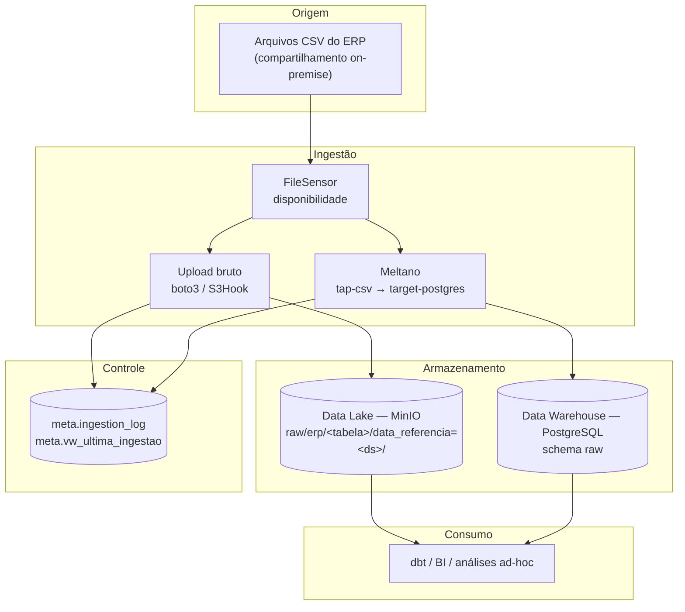

# Arquitetura da solução

Documento complementar ao [README](../README.md), com o detalhe de implementação: objetos
criados no cluster, caminho do dado, alternativas avaliadas e limites conhecidos da POC.

---

## 1. Visão em camadas



A separação entre Data Lake e Data Warehouse é deliberada:

| | Data Lake (MinIO) | Data Warehouse (PostgreSQL) |
|---|---|---|
| Formato | arquivo original, intocado | tabelas relacionais |
| Granularidade | uma partição por data de referência | estado atual consolidado |
| Uso | auditoria, reprocessamento, histórico | consulta analítica, BI, dbt |
| Retenção | longa | operacional |

Se o DW precisar ser reconstruído, a origem é o Data Lake — não o sistema legado. Isso tira do
time de ERP a responsabilidade de reenviar dados históricos.

---

## 2. Objetos provisionados pelo Terraform

Todos no namespace `banvic`.

| Tipo | Nome | Função |
|---|---|---|
| Namespace | `banvic` | Isolamento da stack |
| Secret | `banvic-postgres` | Usuário e senha do PostgreSQL |
| Secret | `banvic-minio` | Access key e secret key do MinIO |
| Secret | `banvic-airflow-metadata` | Connection string do banco de metadados |
| Secret | `banvic-airflow-fernet-key` | Criptografia de connections/variables |
| Secret | `banvic-airflow-webserver-key` | Assinatura de sessão do webserver |
| Secret | `banvic-pipeline-env` | `AIRFLOW_CONN_*` e credenciais do Meltano |
| ConfigMap | `postgres-dw-init` | DDL inicial: banco `airflow`, schemas `raw` e `meta` |
| StatefulSet + Service | `postgres-dw` | PostgreSQL 16 (NodePort 30432) |
| Deployment + Service | `minio` | Object storage (NodePort 30900/30901) |
| PVC | `minio-data` | Persistência do MinIO |
| Job | `minio-create-buckets` | Cria `banvic-datalake` e `banvic-airflow-logs` |
| PV + PVC | `banvic-landing-pv` / `banvic-landing` | Landing zone somente leitura |
| Helm release | `airflow` | Chart oficial 1.16.0 (Airflow 2.10.5) |

Ordem de criação garantida por `depends_on`: segredos e volumes primeiro, depois banco e object
storage, o Job de buckets, e só então o Airflow.

---

## 3. Rede e portas

```
Host (WSL2/Linux)          Nó do kind                Serviço no cluster
--------------------       --------------------      --------------------
localhost:18080     ──>    NodePort 30080     ──>     airflow-webserver:8080
localhost:19000     ──>    NodePort 30900     ──>     minio:9000   (API S3)
localhost:19001     ──>    NodePort 30901     ──>     minio:9001   (console)
localhost:15432     ──>    NodePort 30432     ──>     postgres-dw:5432
```

O mapeamento é declarado em `extraPortMappings` (`infra/kind/cluster.yaml`), o que dispensa
`kubectl port-forward` durante a demonstração.

Dentro do cluster, a comunicação usa nomes de serviço
(`postgres-dw.banvic.svc.cluster.local`, `minio.banvic.svc.cluster.local`), nunca IPs.

---

## 4. Caminho de um arquivo

Usando `transacoes.csv` como exemplo:

1. `make seed` copia o arquivo para `/mnt/banvic/landing/transacoes.csv` no nó do kind.
2. O PV `banvic-landing-pv` (hostPath) expõe esse diretório; o PVC `banvic-landing` é montado
   em `/opt/banvic/landing`, somente leitura, no scheduler, nos workers, no triggerer e no pod
   do Meltano.
3. `aguardar_fontes.aguardar_transacoes` confirma a presença do arquivo pela connection
   `fs_banvic`.
4. `carga_datalake.datalake_transacoes` conta os registros com o parser de CSV, calcula o
   SHA-256 e envia para
   `s3://banvic-datalake/raw/erp/transacoes/data_referencia=<ds>/transacoes.csv`.
5. `carga_dw` roda `meltano run tap-csv target-postgres` em um pod dedicado; o `target-postgres`
   cria uma tabela temporária e aplica `MERGE` em `raw.transacoes` por `cod_transacao`.
6. `validacao_dw.validar_transacoes` compara a contagem do arquivo com a do destino e verifica
   chave nula e duplicada.
7. `registrar_execucao` grava as duas camadas em `meta.ingestion_log`.

---

## 5. Alternativas avaliadas

| Decisão | Alternativa | Por que não |
|---|---|---|
| kind | Minikube | Mais pesado, exige driver de VM ou configuração extra de Docker; publicar portas do nó é menos direto |
| PostgreSQL próprio | Subchart `bitnami/postgresql` do chart do Airflow | Acoplaria o DW ao ciclo de vida do release e depende da distribuição Bitnami, que mudou de política de imagens |
| `KubernetesPodOperator` | `BashOperator` com Meltano na imagem do Airflow | Misturaria as dependências das duas ferramentas na mesma imagem e impediria escalar a carga separadamente |
| DAGs na imagem | `git-sync` | Exigiria credencial de repositório e rede externa durante a execução |
| Logs no MinIO | PVC de logs `ReadWriteMany` | O provisionador local do kind é RWO; log remoto é a solução recomendada para `KubernetesExecutor` e reaproveita o object storage que já existe |
| Carga full com `MERGE` | Carga incremental por watermark | A origem é um snapshot de arquivos, sem coluna confiável de atualização; full + upsert é correto e idempotente nesse volume (~76 mil registros) |

---

## 6. Limites conhecidos

Pontos assumidos conscientemente por se tratar de uma POC:

- **Nó único.** Sem alta disponibilidade e sem tolerância a falha de nó.
- **Tipos como texto no schema `raw`.** É a escolha certa para uma camada de espelho, mas exige
  a camada de transformação para análise séria.
- **Sem `state backend` compartilhado no Meltano.** Como a replicação é `FULL_TABLE`, o estado
  não altera o resultado; em cenário incremental seria obrigatório persistir o state.
- **Landing zone populada por script.** Em produção seria um bucket, um NFS ou um SFTP
  monitorado pelo sensor, não um `docker cp`.
- **Segredos em Secrets nativos do Kubernetes** (codificados em base64, não criptografados em
  repouso). O passo natural é Vault, Sealed Secrets ou o gerenciador de segredos da nuvem.
